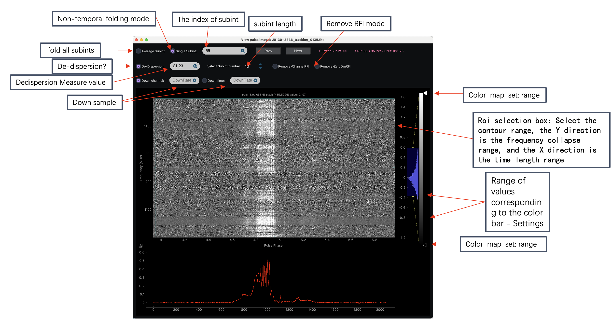

# PDDT


**PDDT: Psrfits Data Deal Tool**

### 

Dependencies

```shell
os
re
sys
math
time
argparse
numpy
astropy
matplotlib
scipy
pyqtgraph
PyQt5
datetime
```


## Cut Psrfits Data


**Purpose**: Cut out fragments from psrfits data (search mode), following subint index


### Usage


```shell
python CutPsrfits.py xxx.fits -sttsub val1 -endsub val2  
```

Among them:

> xxx.fits is psrfits file in search mode 
>
> val1 is start subint index, data type: int
>
> val2 is end subint index, data type: int


## Psrfits Data Visualization (search mode)


### Usage


```shell
python view_rawdata.py  xxx.fits
```



